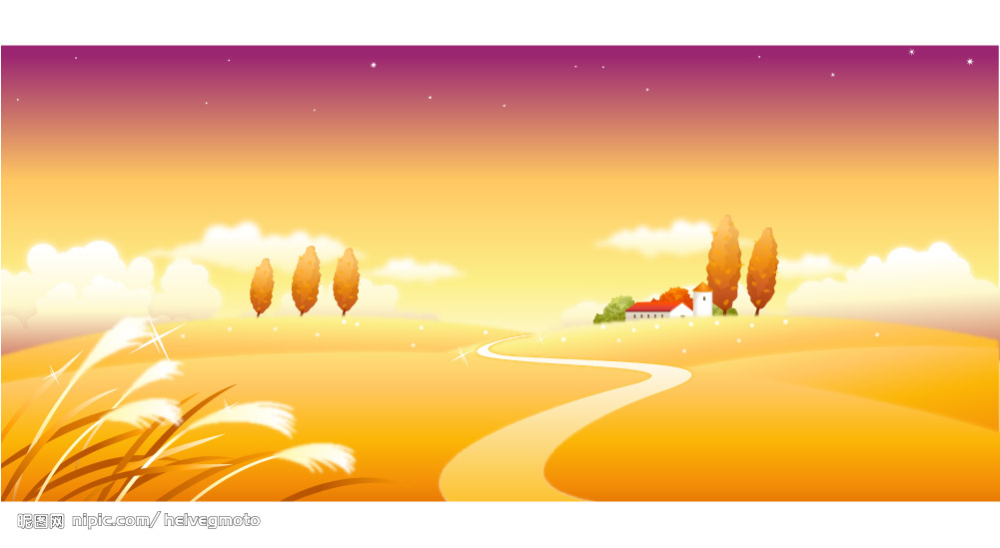
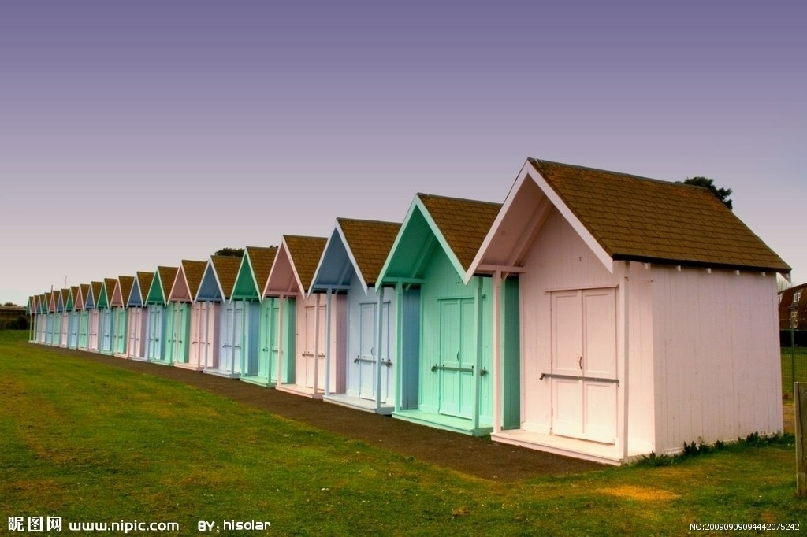

# 过渡

特点：当前元素只要有“属性”发生变化时，可以平滑的进行过渡，并不仅仅局限于hover状态。

transition-property 设置过渡属性

transition-duration 设置过渡时间

transition-timing-function 设置过渡动画效果

transition-delay 设置过渡延时

以上四属性重在理解

```
连写顺序要求: 执行时间 必须在 延迟时间前面 
transition: all 1s ease 2s;
```


# 渐变

## 线性渐变

linear-gradient 线性渐变指沿着某条直线朝一个方向产生渐变效果。 

必要的元素：方向, 颜色, 渐变范围

1. 渐变的方向, 0deg是向上渐变, 旋转方向顺时针, 记忆: 时钟方向.  (当然也可以 to right, to top...)
2. 渐变的颜色和范围(常用百分比,px也可以), 如果不设置范围, 颜色平均分布

```
由于本身渐变的存在, 就是为了替换掉渐变的背景图片的, 所以是 background-image
background-image: linear-gradient( 方向, 颜色 范围, 颜色 范围, ....)
```


## 径向渐变

最常见用法 :

```
径向渐变: 半径(渐变范围) at 圆心位置, 颜色, 颜色, 颜色...
radial-gradient( 100px at 100px 100px, red, blue, green )
超出半径区域的用最外面的颜色来填充
```


# 2D转换

转换是CSS3中具有颠覆性的特征之一，可以实现元素的位移、旋转、缩放，配合过渡和动画知识，可以取代大量之前只能靠Flash才可以实现的效果。


## 平移 translate

移动 translate(x, y) 可以改变元素的位置，x、y可为负值；

- (1) 移动位置相当于自身原来位置

- (2) y轴正方向朝下

- (3) 除了可以像素值，也可以是百分比，相对于自身的宽度或高度

  ​


## 缩放 scale

缩放 scale(x, y) 可以对元素进行水平和垂直方向的缩放，x、y的取值可为小数；


## 旋转 rotate

旋转 rotate(deg) 可以对元素进行旋转，正值为顺时针，负值为逆时针；

- (1) 当元素旋转以后，坐标轴也跟着发生的转变
- (2) 调整顺序可以解决，把旋转放到最后


## 斜切 skew

斜切 skew(x, y) 传角度, 可以让盒子变倾斜, skewX 是纵向拍扁的效果, skewY 是横向拍扁的效果


# 3D转换

> transform:不仅可以2D转换，还可以进行3D转换。

思考 2d 和 3d 的区别 ?  2d 游戏


## 坐标轴

> 用X、Y、Z分别表示空间的3个维度，三条轴互相垂直。***注意+Y是向下的。*** 
>


## rotate旋转

```javascript
transform: rotate(45deg);// 让元素在平面2D中旋转
transform: rotateX(45deg);// 让元素沿着X轴转45度
transform: rotateY(45deg);// 让元素沿着Y轴转45度
transform: rotateZ(45deg);// 让元素沿着Z轴转45度
```


问题：看不出来怎么转的，为什么现实生活中能够看出来？ 


## translate平移

```javascript
/*沿着X轴的正方向移动45px*/
transform: translateX(45px);
/*沿着Y轴的正方向移动45px*/
transform: translateY(45px);
/*沿着Y轴的正方向移动45px*/
transform: translateZ(45px);
```


## perspective透视

> 电脑显示屏是一个2D的平面，因为我们看不出来旋转的方向，通过perspective属性，**指定观察者与「z=0」平面的距离，使具有三维位置变换的元素产生透视效果**，单位是px。
>
> 说白了，设置了perspective属性后，就有了近大远小的效果了，在视觉上，有3d透视的效果。

注意：当为元素定义 perspective 属性时，其子元素会获得透视效果。(给父元素加)

```javascript
perspective：500px;
```

关于近大远小






对于我们眼睛来说，离我们越近的房子，我们会感觉到这个房子越大，离我们越远的房子，就会感觉越小，其实房子的大小都是一样的，只是在视觉上的一种不同。


## transform-style

> transform-style 属性规定如何在 3D 空间中呈现被嵌套的元素。注意这个属性也是给父元素添加。

```javascript
flat:默认值，2d显示
preserve-3d: 3d显示
```

transform-style与perspective的区别
```javascript
/*透视：透视只是相当于设置了一个距离，实现了近大远小的效果, 辅助我们查看3D效果的工具，*/
/*preserve-3d:给父盒子添加，让子元素3D的空间布局，说白了，只有设置了preserve-3d，这个元素才能被称之为3d元素。 */

//一个3d元素可以没有perspective，但是不能没有transform-style
```


# 动画

> 动画也是CSS3中具有颠覆性的特征之一，可以通过设置多个节点来精确控制一个或者一组动画，常用来实现复杂的动画效果。

动画与过渡的区别：

	1. 过渡必须触发，需要两个状态的改变。
	2. 动画可以一直运行下去，不需要触发。实现效果与过渡差不多


使用一个动画的基本步骤：
```javascript
//1.通过@keyframes指定动画序列
//2.通过百分比或者from/to将动画分割成多个节点
//3.在各个节点中分别定义动画属性
//4.通过animation将动画应用于相应的元素
```


## animation详解

> animation是一个复合属性，一共有8个参数

```javascript
animation-name:动画名称，由@keyframes定义的
animation-duration：动画的持续时间
animation-timing-function：动画的过渡类型
animation-delay：动画的延迟时间
animation-iteration-count：动画的循环次数
animation-direction：设置动画在循环中是否反向运动
animation-fill-mode：设置动画时间之外的状态
animattion-play-state:设置动画的状态。
```


## 动画库的使用

[https://isux.tencent.com/css3/index.html](https://isux.tencent.com/css3/index.html)

[https://daneden.github.io/animate.css/](https://daneden.github.io/animate.css/)


