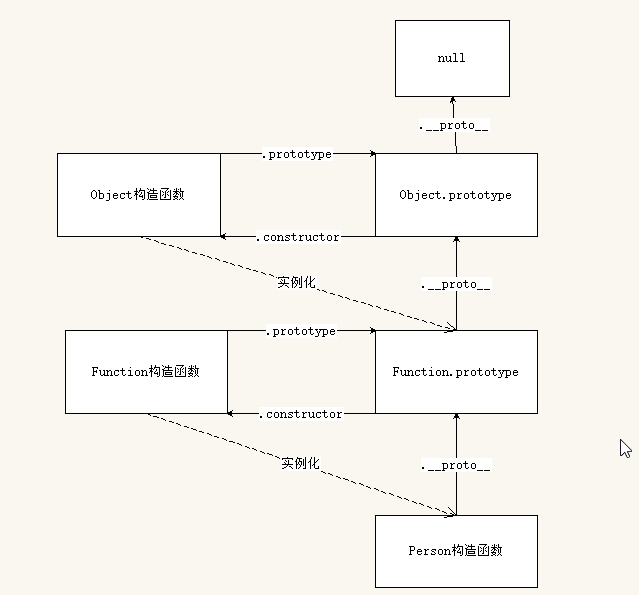
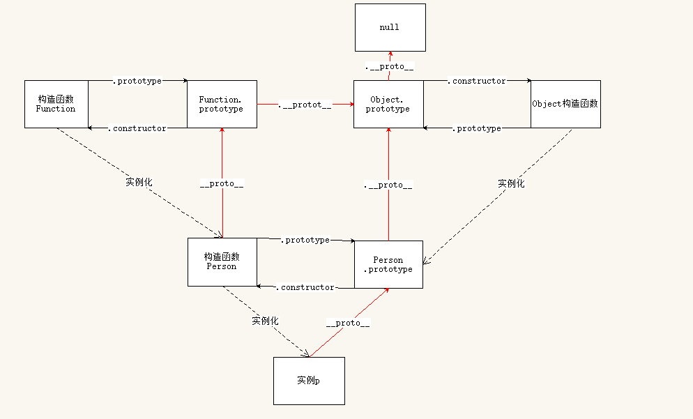
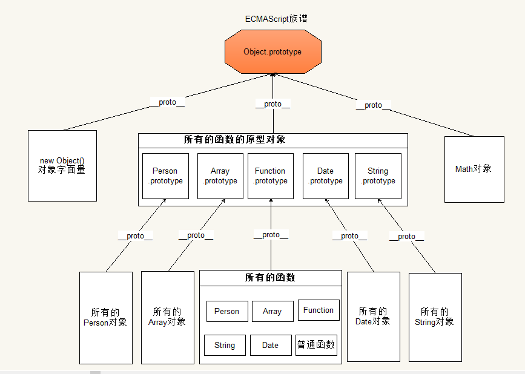

# 1. 函数进阶

## 1.1 定义函数的三种方式

### 1.1.1 函数声明

```javascript
fn();//函数声明可以先调用，在声明
function fn(){
  console.log("这是函数声明")
}
```

### 1.1.2 函数表达式

```javascript
var fn = function() {
  console.log("这是函数表达式");  
}
fn();//函数表达式必须先声明，再调用
```
### 1.1.3 构造函数Function

```javascript
//函数也是对象，可以使用Function构造函数new出来
//相当于var fn = function(){}
var fn = new Function();

//语法：new Function(arg1,arg2,arg3..,body);
// 1. 所有的参数都是字符串类型。
// 2. 前面可以定义任意多个形参，最后一个参数是代码体。
var fn = new Function("alert(1111)");
fn();

var fn1 = new Function("a1", "a2", "alert(a1+a2)");
fn1(1,2);
```
【案例：代码实时预览效果.html】

## 1.2 函数的四种调用模式

> 根据函数内部this的指向不同，可以将函数的调用模式分成4种

1. 函数调用模式
2. 方法调用模式
3. 构造函数调用模式
4. 上下文调用模式（借用方法模式）

```javascript
函数：当一个函数不是一个对象的属性时，我们称之为函数。
方法：当一个函数被保存为对象的一个属性时，我们称之为方法。
```

### 1.2.1 函数调用模式

<font color="red">如果一个函数不是一个对象的属性时，就是被当做一个函数来进行调用的。此时this指向了window</font>

```javascript
function fn(){
  console.log(this);//指向window
}
fn();
```


### 1.2.2 方法调用模式

<font color="red">当一个函数被保存为对象的一个属性时，我们称之为一个方法。当一个方法被调用时，this被绑定到当前对象

```javascript
var obj = {
  sayHi:function(){
    console.log(this);//在方法调用模式中，this指向调用当前方法的对象。
  }
}
obj.sayHi();
```


### 1.2.3 构造函数调用模式

<font color="red">如果函数是通过new关键字进行调用的，此时this被绑定到创建出来的新对象上。</font>

```javascript
function Person(){
  console.log(this);
}
Person();//this指向什么？
var p = new Person();//this指向什么？
```

**总结：分析this的问题，主要就是区分函数的调用模式，看函数是怎么被调用的。**


+ 面试题1：

```javascript
var obj = {
  sayHi:function(){
    console.log(this);
  }
}

var fn = obj.sayHi;
fn();  //请问打印结果是什么？
```

+ 面试题2

```javascript
var fn = function (){
  console.log(this);
}
var obj = {
  sayHi:fn
}
obj.sayHi();//打印结果是什么？
```

+ 面试题3

```javascript
var age = 38;
var obj = {
  age:18,
  getAge:function () {
    console.log(this.age);//???
    function foo(){
      console.log(this.age);//????
    }
    foo();
  }
}
obj.getAge();
```

### 1.2.4 上下文调用模式

> 上下文调用模式也叫方法借用模式，分为apply与call
>
> 使用方法： 函数.call() 或者 函数.apply()


#### 1.2.4.1 call方法

call方法可以调用一个函数，并且可以指定这个函数的`this`指向

```javascript
//所有的函数都可以使用call进行调用
//参数1：指定函数的this，如果不传，则this指向window
//其余参数：和函数的参数列表一模一样。
//说白了，call方法也可以和()一样，进行函数调用，call方法的第一个参数可以指定函数内部的this指向。
fn.apply(thisArg, arg1, arg2, arg2);
```

练习：

+ 借用对象的方法

#### 1.2.4.2 apply方法

`apply()`方法的作用和 `call()`方法类似，只有一个区别，就是`apply()`方法接受的是**一个包含多个参数的数组**。而`call()`方法接受的是**若干个参数的列表**

call和apply的使用场景：

+ 如果参数比较少，使用call会更加简洁
+ 如果参数存放在数组中，此时需要使用apply

#### 1.2.4.3 伪数组与数组

> 伪数组也叫类数组

1. 伪数组其实就是一个对象，但是跟数组一样，伪数组也会有`length`属性，也有`0,1,2,3`等属性。
2. 伪数组并没有数组的方法，不能使用`push/pop`等方法
3. 伪数组可以跟数组一样进行遍历，通过下标操作。
4. 常见的伪数组：`arguments`、`document.getElementsByTagName的返回值`、`jQuery对象`

```javascript
var arrayLike = {
  0:"张三",
  1:"李四",
  2:"王五",
  length:3
}
//伪数组可以和数组一样进行遍历
```

+ 伪数组借用数组的方法

```javascript
Array.prototype.push.call(arrLike, "赵六");
```

+ 将伪数组转换成真数组

```javascript
var arr = Array.prototype.slice.call(arrLike);
```

#### 1.2.4.4 bind方法   

**bind()**方法创建一个新的函数, 可以绑定新的函数的`this`指向

```javascript
//返回值：新的函数
//参数：新函数的this指向，当绑定了新函数的this指向后，无论使用何种调用模式，this都不会改变。
var newFn = fn.bind(window);
```

## 1.3 函数也是对象

> 函数是由new Function创建出来的，因此函数也是一个对象， `所有的函数都是new Function的实例`。

### 1.3.1 函数的原型链结构

画出下列代码的原型链结构

```javascript
//var Person = new Function();
function Person(){
  
}
```



### 1.3.2 完整版原型链

> 绘制完整版原型链的目的是辅助大家理解js中对象的继承关系。



总结：

1. 所有函数都是new Function创建出来的，因此`所有函数.__proto__`都是`Function.prototype`
2. 所有对象都是new Object创建出来的，因此`所有对象.__proto__`都是`Object.prototyp`

### 1.3.3 ECMAScript族谱



### 1.3.4 Function.prototype成员

+ arguments：获取函数的实参，被函数内部的arguments替代了。
+ length：获取形参的长度
+ name：获取函数的名字，此属性不允许修改
+ caller:用于获取当前在函数是在哪个函数中调用的，已经被废弃了。
+ constructor：指向当前构造函数，Function
+ call：调用函数，重新指向this
+ apply：调用函数，重新指向this
+ bind：重新指向this，返回一个新的函数，不调用。

## 1.4 预解析与作用域

### 1.4.1 预解析

> 预解析：预先解析

js执行代码分为两个过程：

+ 预解析过程（变量与函数提升）
+ 代码一行一行执行

预解析过程：JavaScript解析器在执行代码前，会把所有变量的声明和函数的声明提升到当前作用域的顶部。例如`var a = 11;`其实会分为`var a;` 和`a = 11`两部分，其中`var a;`会被提升。

预解析规则：

1. 函数优先，先提升function，后提升var
2. 遇到重名的var会被忽略。
3. 遇到重名的function会被覆盖。

+ 思考以下代码的结果

```javascript
console.log(a);
function a() {
  console.log("aaaaa");
}
var a = 1;
console.log(a);
```

**推荐：不要在一个作用域内重复的声明相同的变量和函数**

### 1.4.2 作用域

> 作用域：变量起作用的区域，作用域决定了一个变量被定义在哪里，以及该如何被查找。

全局变量：在函数外定义的变量就叫全局变量，全局变量在任何地方都能访问到。

局部变量：在函数内定义的变量就叫局部变量，局部变量只有在当前函数内才能访问到。

```javascript
var num = 11;//全局变量
function fn(){
  var num1 = 22;//局部变量
  console.log(num1);
}
console.log(num);
```


编程语言中，作用域规则分为两种：

+ 词法作用域（静态作用域）
+ 动态作用域

JavaScript采用的是`词法作用域`规则，`词法作用域`也叫`静态作用域`,变量在函数声明的时候，它的作用域就定下来了，与函数的调用无关。

```javascript
var num = 123;
function f1() {
  console.log(num);
}

function f2(){
  var num = 456;
  f1();
}
f2();//打印啥？
```

### 1.4.3 作用域链

> 作用域链：只要是函数，就会形成一个作用域，如果这个函数被嵌套在其他函数中，那么外部函数也有自己的作用域，这个一直往上到全局环境，就形成了一个条作用域链。

`变量的搜索原则`：

1. 从当前作用域开始搜索变量，如果存在，那么就直接返回这个变量的值。
2. 如果不存在，就会往上一层作用域查询，如果存在，就返回。
3. 如果不存在，一直查询到全局作用域，如果存在，就返回。如果不存在说明该变量是不存在的。
4. 如果一个变量不存在
   + 获取这个变量的值会报错`xxx is not defined;`，
   + 给这个变量设置值，那么设置变量就是`隐式全局变量`。

```javascript
var str = "123";
function fn(){
  var str = "456";
  console.log(str);//???
}
fn();
console.log(str);//???
```

### 1.4.4 绘制作用域链

1. 全局作用域只要页面不卸载，就一直存在，不释放。
2. 函数每次在调用时，都会形成一个作用域，当函数调用结束时，这个作用域就释放了。

+ 练习1

```javascript
var num = 10;
fn1();
function fn1() {
  console.log(num);
  var num = 20;
  console.log(num);
}
console.log(num);
```

+ 练习2

```javascript
var num1 = 10;
var num2 = 20;
function fn(num1) {
  num1 = 100;
  num2 = 200;
  num3 = 300;
  console.log(num1);//100
  console.log(num2);//200
  console.log(num3);//300
  var num3;
}
fn();
console.log(num1);//10  100
console.log(num2);//200
console.log(num3);//报错
```

+ 练习3

```javascript
fn3();
console.log(c);//9 undefined
console.log(b);//9 
console.log(a);//报错

function fn3() {
  var a = b = c = 9;
  console.log(a);//9
  console.log(b);//9
  console.log(c);//9
}
```

+ 练习4

```javascript
var num = 1;
function fn(){
  var num = 100;
  num++;
  console.log(num);
}
fn();//101
fn();//101
console.log(num);//1
```

+ 练习5

```javascript
var color = "red";
function outer() {
    var anotherColor = "blue";

    function inner() {
        var tmpColor = color;
        color = anotherColor;
        anotherColor = tmpColor;
        console.log(anotherColor);
    }

    inner();
}
outer();
console.log(color);

//red blue
```


## 1.5 递归函数

> 递归函数：函数内部直接或者间接的调用自己

递归的要求：

1. 自己调用自己（直接或者间接）
2. 要有结束条件（出口）

递归函数主要是`化归思想` ,将一个复杂的问题简单化，主要用于解决数学中的一些问题居多。

+ 计算1-n之间所有数的和
+ 计算斐波那契数列
+ 递归实现深拷贝

# 2. jQuery框架封装

## 2.1 沙箱模式

```javascript
;(function(window, undefined){
  //jQuery的构造函数
  var jQuery = function(){
      
  }
  
  //替换了jQuery的原型对象
  jQuery.prototype = {
    constructor:jQuery,
    jquery:"1.0.0",
    sayHi:function(){
      console.log("呵呵");
    }
  }
  
  //对外暴露两个全局变量， $ 和jQuery
  window.$ = window.jQuery = jQuery;
  
})(window);
```
