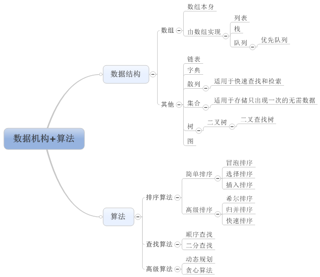

## 面试问题

### 移动端开发

#### 移动端事件

| 事件          | 描述       |
| ----------- | -------- |
| touchstart  |          |
| touchmove   |          |
| touchend    |          |
| touchcancel | 系统停止跟踪时  |
| onclick     | 有300ms延迟 |

#### 移动端开发特点

- 只需要兼容 webkit内核的浏览器, 以及 Chrome, uc, qq 等其他浏览器.
- 需要适配不同分辨率的屏幕.

####如何解决 300ms 的延迟

**问题缘由：** 苹果公司，双击屏幕可以让整个页面放大，如果用户点击屏幕 300ms 后没有其他操作就认为是单击，否则就是双击操作。

**解决方法：**使用插件 - FastClick.

### AJAX

#### 简述原生实现AJAX

> AJAX: **A** (async) **JA** (javascript) **X** (XML)

```javascript
// 创建一个 XMLHttpRequest 实例
let xhr = new XMLHttpRequest
// 设置请求行, get请求需要带参数, post请求则将参数放在请求体中, open方法第三个参数默认为 true 执行异步请求
// 参数一请求方式, 参数二请求地址, 参数三是否异步: 默认 true
xhr.open('POST', url, async)
// 如果是post请求需要设置请求头, 不然后端无法解析数据
xhr.setRequestHeader('content-type', 'application/x-www-form-urlencoded')
// 发送请求体, get请求不需要, 设置为 null, 请求体一定要在监听响应事件之前设置, 不然可能导致无法接受响应
xhr.send('name=atom&age=26')
// 监听状态
xhr.onreadystatechange = function () {
  let result = null;
  if (xhr.readyState === 4 && xhr.status === 200) {
    // 获取响应体
    result = xhr.responseText;
    console.log(result);
  }
} // onreadystatechange end
```

#####readyState

| 状态                   | 描述        |
| -------------------- | --------- |
| 0 : UNSENT           | open 尚未调用 |
| 1 : OPENED           | open 已调用  |
| 2 : HEADERS_RECEIVED | 接收到头信息    |
| 3 : LOADING          | 接收到响应主体   |
| 4 : DONE             | 响应完成      |

#### JQ-AJAX的常用参数

| 参数         | 描述                                       |
| ---------- | ---------------------------------------- |
| url        | API接口                                    |
| data       | 上传参数                                     |
| type       | 请求方式                                     |
| datatype   | 接收数据类型(xml,html,script,json,jsonp,text)  |
| success    | 成功后可以拿到数据                                |
| error      | 请求失败                                     |
| beforeSend | 回调函数, 发送请求之前调用,  传入XMLHttpRequest对象作为参数  |
| complete   | 请求完成之后调用, 无论失败或者成功都会触发. 传入XMLHttpRequest 对象和一个描述成功请求类型的字符串 |
| async      | 默认 true , false 可以改成同步                   |

#### 出现 error 的原因

- 没有处理跨域.
- datatype 的设置 与 后端返回的数据类型不符.
- 服务器挂了.
- 其他等, 请求失败的原因.

#### ajax的特点

- 异步请求, 实现局部刷新.
- 按需获取资源, 节约带宽.
- 基于标准化的并被广泛支持的技术, 不需要下载其他插件.

####ajax的缺点

- 不利于 **SEO** .
- 安全性低 .

### 跨域与同源

#### 简述同源

**同源**

- 协议相同
- 域名相同
- 端口相同

> 同源策略的目的是保证用户信息安全, 防止恶意网站窃取数据.

#### JSONP特点

JSON with Padding .

可以解决主流浏览器的跨域问题 .

#### JSONP实现原理

> 服务端返回一个定义好的 **JS函数** 调用, 并且讲服务器的数据以该函数参数的形式传递过来, 这个方法需要前后端配合.

`script` `img` `link` 等标签都不受同源策略的限制, `script` 可以载入任意地方的 **JS文件** 。 

```javascript
function jsonp(options) {
  window[options.callbackName] = function (data) {
    console.log(data);
    window[options.callbackName] = null;
  }
  const script = document.createElement('script');
  script.src = `${options.url}?callback=${options.callbackName}`;
  document.body.appendChild(script);
  document.body.removeChild(script);
}

jsonp({
  callbackName: 'jsonp', // 这个方法是直接给全局调用的, 需要有名字,才能调用函数.
  url: 'https://api.douban.com/v2/book/122056',
})
```

#### JSONP缺点

- 只支持 **get** 请求.
- 调用失败时, 不会返回各种HTTP状态码.
- 安全性低.

#### 简述CORS

跨资源共享, 只支持 IE10 以上, 需要服务器允许.

```php
// 允许所有域名访问这个接口
header('Access-Control-Allow-Origin:*')
// 允许某个域名访问这个接口
header("Access-Control-Allow-Origin:http://www.jepson.com")
```

### 响应式布局 , bootstrap

#### 响应式布局的实现方法

通过媒体查询.

#### 简述栅格系统

根据屏幕或者视口的尺寸, 系统会自动分为最多12列.

### 模板引擎

#### 实现原理

通过正则表达式, 检测标签并替换.

#### 模板引擎缺点

不好调试.

### BOM

#### BOM常用API

> 以 **window** 开头的方法, 大多数情况下可以省略 **window** .

| API                 | 描述                                       |
| ------------------- | ---------------------------------------- |
| location            | 浏览器的地址栏: .href, .reload(), .hash, .host, .search, 等... |
| setTimeOut          |                                          |
| setInterval         |                                          |
| navigator.userAgent | 查看浏览器信息                                  |
| history             | 页面的历史: .back(), .go(1), 等...             |
| screen              | .width, .height, 等...                    |
| open                | 打开一个小窗口                                  |
| close               | 关闭一个小窗口                                  |

### Vue

#### Vue有什么特点?

- 数据双向绑定
- MVVM思想
- 自定义指令
- 生命周期
- 虚拟DOM树

### jQuery

#### JQ常用API

| API  | 描述   |
| ---- | ---- |
| $()  | 选择器  |
| ajax |      |
| html |      |
| text |      |
| css  |      |

各种过度动画

#### JQ选择器原理

- getElementById
- querySelectorAll

返回一个 JQ 对象, 是一个伪数组.

#### zepto与jquery的区别I?

**zepto** 主要针对移动端, 更加轻量级, bug也更多.

### LESS

#### less是什么, 有什么特点?

- css预处理器
- 可以设置变量
- 可以继承
- 可以进行运算

#### less常用语法

| 方法         | 描述                                |
| ---------- | --------------------------------- |
| `@`        | 声明变量 .                            |
| `类名()`     | 混入函数, 可以传入参数, 参数名后加 `:` 可以指定默认值 . |
| `@import`  | 导入 .                              |
| `@charset` | 指定字符集, 一般设定为 `UTF-8` .            |

### CSS

#### link 与 @import的区别

- link 是 XHTML 标签, @import 是 CSS提供的一种方式
- 加载顺序: 浏览器解析到 link 标签时, 会直接记载其中的所链接的文件, @import 会等到页面全部下载完毕才开始加载CSS文件
- 兼容性: @import 由 CSS2.1提出, 老浏览器不支持, link无兼容性问题
- js操作dom的时候, 只能用 link标签, @import的dom是不可控的

### CSS3

#### CSS3新特性?

> 新增了属性选择器 `[]` .

| 属性               | 描述                                       |
| ---------------- | ---------------------------------------- |
| border-radius    | 圆角                                       |
| box-shadow       | 阴影                                       |
| text-shadow      | 文字阴影                                     |
| text-outline     | 文本轮廓                                     |
| text-overflow    | 文本溢出处理                                   |
| text-wrap        | 文本换行规则                                   |
| linear-gradient  | 线性渐变                                     |
| radial-gradient  | 径向渐变                                     |
| transform        | 2D, 3D, 变化: translate, scale, rotate, skew. 3D特有: **perspective** . 等... |
| transform-origin | 变化位置                                     |
| animation        | 动画                                       |

####CSS3动画有什么特点?

更加流畅, 效果更好, 性能也更好.

可以调用 GPU硬件加速 来处理: `translateZ` `translate3d` 等.

### HTML

#### XHTML 和 HTML 的区别

HTML 是一种基本的WEB网页设计语言, XHTML 是一个基于 XML 的置标语言, 两者的差异是, XHTML 中, 元素必须被正确的嵌套, 元素必须被关闭, 标签名必须小写. XHTML文档必须拥有更元素.

### HTML5

#### H5新特性

| 特性                          | 描述         |
| --------------------------- | ---------- |
| header,footer,aside,section | 语义化标签      |
| placeholder                 | 占位符        |
| autofocus                   | 自动聚焦       |
| audio,video                 | 多媒体        |
| display controls            | 控制条        |
| canvas,svg                  | 画布, 矢量图    |
| email,tel,search,number     | input新增的类型 |

### jQuery

#### $.fn的作用

配合 $.extend 方法 来给 JQ对象添加方法

一般用于 jquery插件

### JavaScript

#### JS数据类型

- 基本数据类型: Number, String, Boolean,null, undefined
- 复杂数据类型: Object(Function, Array, Date)

#### 模块化规范有几种

- CMD
- AMD
- CommonJS

#### javascript AMD 规范主要解决了什么问题

它采用了异步的方式加载模块, 模块的加载不影响后面的语句运行, 所有依赖这个模块的语句, 都定义在一个回调函数中, 等模块全部加载完成, 回调函数才会执行.

主要解决了各个模块之间的依赖关系, 可以顺序的加载 JS 模块, 但是这个行为却是异步操作, 不会影响页面的 css 和 html标签的加载.

#### ECMA 和 JS 是什么关系

ECMA 是 JS 的标准, 而JavaScript是实现.

#### typeof 返回的数据类型

- undefined
- object: null 也算作是 object
- boolean
- number
- string
- function: 函数对象
- symbol: ES6 新增
- Implementation-dependent: 宿主对象, 由 JS环境 提供

#### 序列化和反序列化的方法

- 序列化: Object => JSON

  ```javascript
  //  将JSON对象转化为JSON字符
  obj.toJSONString()
  //  或者
  JSON.stringify(obj)
  ```

- 反序列化: JSON => Object

  ```javascript
  // 将JSON字符转化为对象
  data.parseJSON()
  //  或者
  JSON.parse(data)
  ```

#### 闭包

闭包就是能够读取其他函数内部变量的函数, 我们通常理解为函数内部的函数.

可以从外部读取函数内部的变量或将变量保存在内存中.

**优点**

- 避免全局污染, 保存私有变量.

**缺点**

- 更多的内存消耗, 容易造成内存泄漏.

**使用场景**

- 封装.
- 实现缓存.
- 保存状态.

#### 本地存储

#####方式

1. cookie

   大小: 4k .

   获取方式: 每次请求都会携带.

   生命周期: 默认是会话 cookie , 浏览器关闭就失效了, 设置过期时间.

   特性: 有路径问题, 子目录可以访问父目录的 cookie , 但是父目录无法访问子目录的 cookie , 通常设置路径为根路径.

2. sessionStorage

   大小: 5m 左右.

   获取方式: 必须手动获取, 不会自动携带, `getItem` 来获取.

   生命周期: 关闭浏览器失效, 多窗口不共享.

3. localStorage

   大小: 5m 左右.

   获取方式: 必须手动获取, 不会自动携带, `getItem` 来获取.

   生命周期: 只要不手动清除, 则永久存在, 并且多窗口共享.

#####操作

设置

```javascript
localStorage.setItem('username', 'atom');
```

获取

```javascript
localStorage.getItem('username');
```

删除

```javascript
localStorage.removeItem('username');
```

设置对象

```javascript
localStorage.setItem('obj', JSON.stringify(obj));
localStorage.getItem('obj');
```

#### 原生JS实现事件委托?

> 事件委托就是利用事件冒泡，只指定一个事件处理程序.

```javascript
let box = document.createElement('div')
document.body.appendChild(box)
box.addEventListener('click', function (e) {
  if (e.target.nodeName === 'INPUT') console.log(e.target.value);
})
function createBtn(i) {
  let input = document.createElement('input')
  input.type = 'button'
  input.value = `第 ${i} 个按钮`
  box.appendChild(input)
}
for (var i = 0; i < 10; i++) {
  createBtn(i)
}
```

#### 事件三阶段?

1. 事件的捕获阶段
2. 事件的目标阶段 (触发自己的事件)
3. 事件的冒泡阶段

> 对于捕获和冒泡, 我们通常只能干预其中一个, 大多数情况, 我们可能会干预事件的冒泡.

#### 简述一下重绘和重排(回流)

**重绘:** 元素外观的变化所引起的浏览器行为, 例如改变颜色, 可见度等属性.

**重排:** DOM树重新计算.

**引发重排:** 

- 添加, 删除可见的 DOM
- 元素位置改变
- 元素尺寸改变(margin, padding, border, width, height, ...)
- 页面渲染初始化
- 浏览器窗口尺寸改变

重排必将引起重绘, 重绘不一定会引起重排.

### ES6

#### ES6新特性?

- 解构赋值
- 箭头函数
- 函数默认参数
- Rest & Spread
- 模版字符串
- 对象简写: 当键名与值名相同的情况下, 只要写键名就可以了
- class

### HTTP

#### 简述一下网络协议?

**参考文档:** https://zhuanlan.zhihu.com/p/24913080

**HTTP特性** 

- 无连接
- 无状态
- 一般构建与 TCP/IP 协议上, 默认端口号80

**常见状态码**

| 状态码                         | 描述                     |
| --------------------------- | ---------------------- |
| 1XX                         | 已经接受请求, 处理中            |
| 200 : OK                    | 请求成功                   |
| 301 : Moved Permanently     | 请求永久重定向                |
| 302 : Moved Temporarily     | 请求临时重定向                |
| 304 : Not Modified          | 文件未修改, 可以直接使用缓存文件      |
| 400 : Bad Request           | 客户端请求错误, 服务端无法解析       |
| 401 : Unauthorized          | 请求未经授权, 无法访问           |
| 403 : Forbidden             | 服务器接收到了请求, 但是拒绝提供服务    |
| 404 : Not Found             | 请求的资源不存在               |
| 500 : Internal Server Error | 服务器挂了                  |
| 503 : Service Unavailable   | 服务器当前无法处理请求, 稍后可能会恢复正常 |

### 其他

#### 如何判断用户是否登录?

通过 cookie 携带的 sessionID 与后台进行对比.

#### 性能优化?

- 减少请求次数: 精灵图, webpack打包, 静态资源懒加载
- 压缩资源体积: tinypng 压缩图片
- 后端服务器可以启用 gzip压缩功能
- 尽量给元素指定宽高, 可以减少浏览器的计算量
- 网址后面加上 `/` , 减少服务器判断.


#### 如何实现浏览器内多个标签页之间的通信

1. localstorge 在一个标签页中被添加,修改,删除时, 都会触发一个 storage事件, 通过在另一个标签页面监听 storage事件, 可以得到 localstorge存储的值.
2. 使用 cookie + setInterval, 将传递的信息存储在cookie中, 每隔一定时间读取 cookie信息.

#### 如何解决 callback hell

1. promise
2. 拆解函数, 减少嵌套
3. generator
4. async/await


#### 前端页面三层构成分别是什么,有什么用

- 结构层: 对网页里的元素进行描述
- 表示层: 给网页里的元素添加样式
- 行为层: 通过脚本去操控网页里的元素

#### 常见的浏览器内核

- Trident: IE
- Gecko: FierFox
- Presto: Opear7+
- Webkit: Safari, Chrome(Blink)
- EdgeHTML: Edge

#### 简述MVVM 与 MVC

##### MVC

- Model(数据模型): 数据保存
- View(视图): 用户界面
- Controller(控制器): 业务逻辑

1. View 传输指令给 Controller
2. Controller 改变 Model 的状态
3. Model 重新将数据 发送给 View 

所有通信都是单向的, 例如 Bootstrap.

##### MVVM

数据是双向绑定的.

- Model: 数据模型
- ViewModel: 同步数据和视图的对象
- View: 视图

View 与 Model 通过 ViewModel 相互影响, 例如 Vue.

####OO OOP -- 面向对象编程	

##### OO

Object - Oriented.

面向对象, 基于对象概念, 以对象为中心, 以类和继承为构造机制, 来认识, 理解, 刻画客观世界和设计, 构建相应的软件系统的一门方法, 本意是模拟人类的思维方式, 方便开发, 维护.

##### OOP

Object - Oriented Programming.

把组件的实现和接口分开, 并且让组件具有多态性(抽象, 封装, 继承, 多态), 面向接口编程.

- 继承
- 封装
- 多态: JS没有


####堆 (heap) 和 栈 (stack)

堆是堆内存的简称, 栈是栈内存的简称.

JS中的**基本数据类型(undefined, null, boolean, number, string)**都是直接按值存储在栈中的, 每种类型的数据占用的内存空间大小是确定的, 由系统自动分别和自动释放, 这样的好处是, 内存可以及时回收, 便于管理内存空间.

JS中的**引用数据类型(对象, 数组, 函数等)**他们是通过拷贝或者**new**出来的, 这种数据存储在堆中, 但是, 他们的引用地址存储在栈中, 我们想要访问这些数据的时候, 先要去栈中获取地址指针, 再通过指针找到数据.

- 栈: 线性结构, 后进先出, 便于管理.
- 堆: 一个混沌, 杂乱无章, 方便存储和开辟的内存空间.

#### 数据结构



经典的数据结构有: list, stack, queue, linkedList, dictionary, hash, set, tree, graph ...

文档链接: https://www.jianshu.com/p/5e0e8d183102 

